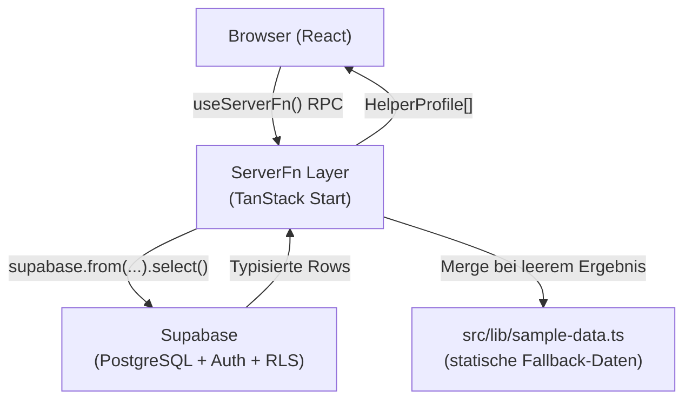
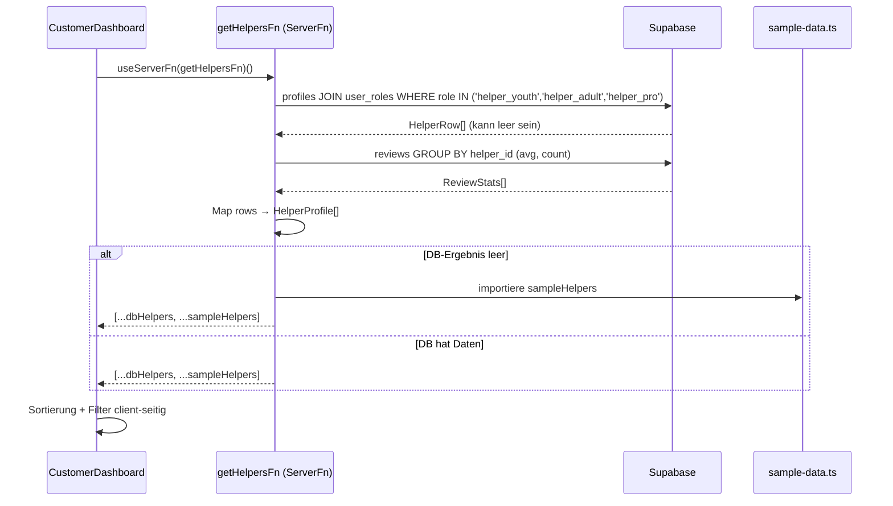
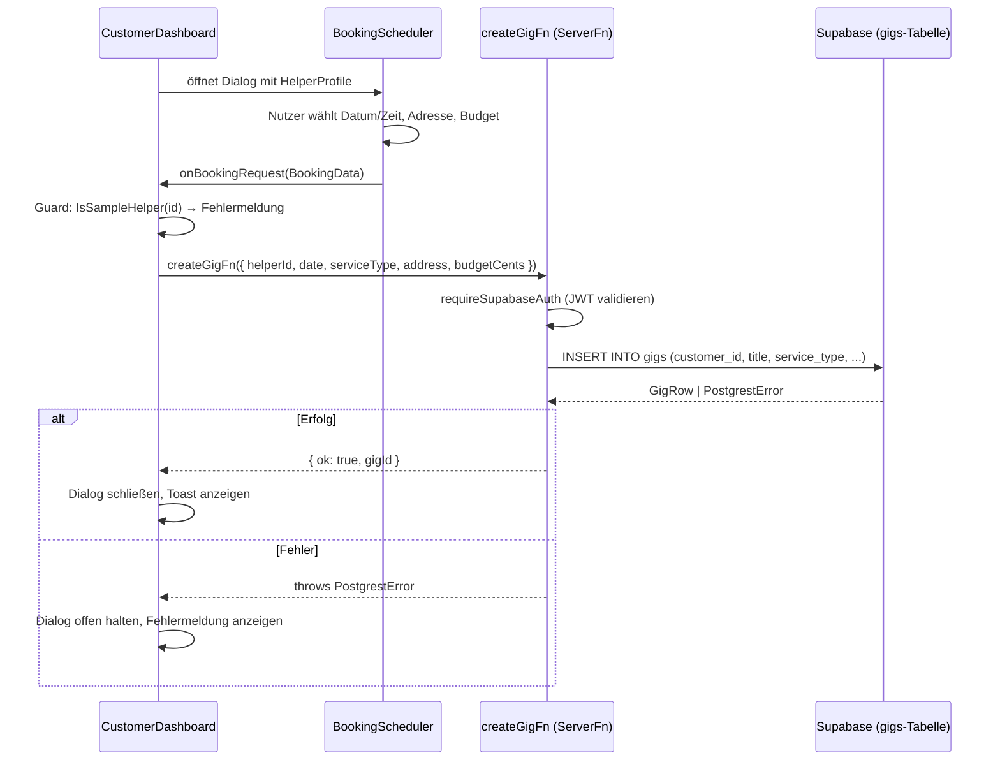

# Technisches Design: Marketplace-Architektur

## Overview

GreenMatch transformiert sich von einem Demo-Prototyp zu einem echten, persistenten Marketplace. Dieses Design beschreibt alle technischen Änderungen, die nötig sind, um echte Supabase-Daten statt hartkodierter Mockdaten zu verwenden, Buchungen persistent zu speichern und die Codequalität zu sichern.

**Technologie-Stack:**
- **Frontend/SSR**: TanStack Start (React 19, SSR via Nitro)
- **Backend-Logik**: TanStack Start ServerFns (RPC-Aufrufe, serverseitig ausgeführt)
- **Datenbank + Auth**: Supabase (PostgreSQL + RLS + Auth JWT)
- **Client-State**: TanStack Query (Caching, Invalidierung)

---

## Architecture

### Systemübersicht



### Datenfluss: CustomerDashboard → Helfer-Listing



### Buchungsfluss



---

## Components and Interfaces

### Neue und geänderte Dateien

| Datei | Änderung | Beschreibung |
|-------|----------|--------------|
| `src/lib/sample-data.ts` | **Neu** | SampleHelper-Daten + `sampleHelpers`-Array ausgelagert |
| `src/lib/customer-dashboard.functions.ts` | **Neu** | ServerFns: `getHelpersFn`, `createGigFn` |
| `src/components/dashboard/customer-dashboard.tsx` | **Refactor** | Echte DB-Daten statt Mockdaten, `HelperProfile` Interface |
| `src/integrations/supabase/types.ts` | **Ergänzung** | `bookings`- und `notifications`-Tabellen typisieren |
| `src/components/dashboard.tsx` | **Löschen** | Tote Datei, nicht importiert |
| `src/components/efferd-dashboard-2.tsx` | **Löschen** | Tote Datei, nicht importiert |


---

## Data Models

### Gemeinsames Interface `HelperProfile`

Dieses Interface ist die einzige Wahrheitsquelle für alle Helfer-Objekte – sowohl DB-Rows als auch SampleHelpers müssen es erfüllen. Das entkoppelt die Darstellungslogik vollständig von der Datenquelle.

```typescript
// src/lib/customer-dashboard.functions.ts

export type HelperRole = "helper_youth" | "helper_adult" | "helper_pro";

export interface HelperProfile {
  /** UUID für DB-Helfer, "sample-{n}" für Demo-Helfer */
  id: string;
  display_name: string;
  city: string | null;
  postal_code: string | null;
  bio: string | null;
  available_today: boolean;
  trust_score: number;
  role: HelperRole;
  /** Durchschnittliche Bewertung (null wenn keine Reviews vorhanden) */
  avg_rating: number | null;
  review_count: number;
  /** Nur für Demo-Helfer gesetzt */
  hourly_rate_cents?: number;
  /** Nur für Demo-Helfer gesetzt */
  image_url?: string;
  /** Ob dies ein Demo-Helfer ist (nicht buchbar) */
  is_sample: boolean;
}
```

### `src/lib/sample-data.ts` – Ausgelagerte Demo-Daten

```typescript
// src/lib/sample-data.ts
import type { HelperProfile } from "@/lib/customer-dashboard.functions";

export const sampleHelpers: HelperProfile[] = [
  {
    id: "sample-1",
    display_name: "Lukas Berger",
    city: "Freiburg",
    postal_code: "79098",
    bio: "Selbstständiger Gärtner mit eigener Ausrüstung, 6 Jahre Erfahrung.",
    available_today: true,
    trust_score: 90,
    role: "helper_pro",
    avg_rating: 4.9,
    review_count: 34,
    hourly_rate_cents: 2800,
    image_url: "https://images.unsplash.com/photo-1507003211169-0a1dd7228f2d?w=300&h=300&fit=crop",
    is_sample: true,
  },
  // ... weitere Sample-Helfer (unverändert aus customer-dashboard.tsx)
];
```

### Typisierung fehlender Tabellen in `types.ts`

Die Tabellen `bookings` und `notifications` fehlen aktuell in `src/integrations/supabase/types.ts`, werden aber in `inbox.tsx` direkt per `supabase.from("notifications")` abgefragt, was TypeScript-Fehler verursacht.

**Lösung:** Beide Tabellen als vollständige `Row`/`Insert`/`Update`-Typen in `Database.public.Tables` eintragen, oder – da `bookings` eine Legacy-Tabelle ist, die durch `gigs` ersetzt wird – `inbox.tsx` auf die `gigs`-Tabelle umstellen. Letzteres ist die bevorzugte Lösung (kein Schema-Ballast).

---

## ServerFn-Signaturen

### `getHelpersFn` – Alle Helfer laden

```typescript
// src/lib/customer-dashboard.functions.ts

export const getHelpersFn = createServerFn({ method: "GET" })
  .middleware([requireSupabaseAuth])
  .handler(async ({ context }): Promise<HelperProfile[]> => {
    const { supabase } = context;

    // 1. Alle Helfer-Profile mit Rollen laden
    const { data: rows, error } = await supabase
      .from("profiles")
      .select(`
        id,
        display_name,
        city,
        postal_code,
        bio,
        available_today,
        trust_score,
        user_roles!inner ( role )
      `)
      .in("user_roles.role", ["helper_youth", "helper_adult", "helper_pro"])
      .order("available_today", { ascending: false })
      .order("trust_score", { ascending: false });

    if (error) throw error; // PostgrestError – wird als solcher behandelt

    // 2. Review-Aggregation (avg + count pro Helfer)
    const helperIds = (rows ?? []).map((r) => r.id);
    const { data: reviews } = helperIds.length
      ? await supabase
          .from("reviews")
          .select("helper_id, rating")
          .in("helper_id", helperIds)
      : { data: [] };

    const reviewMap = buildReviewMap(reviews ?? []);

    // 3. DB-Rows → HelperProfile mappen
    const dbHelpers: HelperProfile[] = (rows ?? []).map((r) => ({
      id: r.id,
      display_name: r.display_name,
      city: r.city,
      postal_code: r.postal_code,
      bio: r.bio,
      available_today: r.available_today,
      trust_score: r.trust_score,
      role: r.user_roles[0].role as HelperRole,
      avg_rating: reviewMap.get(r.id)?.avg ?? null,
      review_count: reviewMap.get(r.id)?.count ?? 0,
      is_sample: false,
    }));

    // 4. SampleHelpers immer anhängen (Marketplace-Auffüllung)
    return [...dbHelpers, ...sampleHelpers];
  });
```


### `createGigFn` – Neuen Gig erstellen

```typescript
// src/lib/customer-dashboard.functions.ts

const CreateGigSchema = z.object({
  helperId: z.string(),               // Nur zur UI-Anzeige, NICHT als assigned_helper_id
  title: z.string().min(3).max(120),
  serviceType: z.string().min(2),
  budgetCents: z.number().int().min(500),
  scheduledAt: z.string().datetime(),  // ISO 8601
  address: z.string().min(5),
  postalCode: z.string().max(20).optional().nullable(),
  durationMinutes: z.number().int().default(60),
});

export const createGigFn = createServerFn({ method: "POST" })
  .middleware([requireSupabaseAuth])
  .validator((input: unknown) => CreateGigSchema.parse(input))
  .handler(async ({ data, context }): Promise<{ ok: true; gigId: string }> => {
    const { supabase, userId } = context;

    // Guard: Sample-Helfer sind nicht buchbar
    if (data.helperId.startsWith("sample-")) {
      throw new Error("SAMPLE_HELPER_NOT_BOOKABLE");
    }

    const { data: gig, error } = await supabase
      .from("gigs")
      .insert({
        customer_id: userId,
        title: data.title,
        service_type: data.serviceType,
        budget_cents: data.budgetCents,
        scheduled_at: data.scheduledAt,
        address: data.address,
        postal_code: data.postalCode ?? null,
        duration_minutes: data.durationMinutes,
        status: "open",
        allowed_age_groups: ["helper_youth", "helper_adult", "helper_pro"],
      })
      .select("id")
      .single();

    if (error) throw error; // PostgrestError – typsicher
    return { ok: true, gigId: gig.id };
  });
```

### `updateProfileFn` – Bio und available_today speichern

```typescript
// Erweiterung von src/lib/helper-dashboard.functions.ts

const UpdateProfileSchema = z.object({
  bio: z.string().max(500).optional().nullable(),
  city: z.string().max(80).optional().nullable(),
});

export const updateProfileFn = createServerFn({ method: "POST" })
  .middleware([requireSupabaseAuth])
  .validator((input: unknown) => UpdateProfileSchema.parse(input))
  .handler(async ({ data, context }): Promise<{ ok: true }> => {
    const { error } = await context.supabase
      .from("profiles")
      .update({ bio: data.bio, city: data.city })
      .eq("id", context.userId);
    if (error) throw error;
    return { ok: true };
  });
```

---

## Datenbankschema-Änderungen

Das bestehende Schema ist für die Kernanforderungen vollständig. Folgende Anpassungen sind nötig:

### Migration 1: `bookings`-Tabelle (Legacy) durch `gigs` ersetzen

Die `inbox.tsx` referenziert eine `bookings`-Tabelle, die nicht im aktuellen Schema existiert. **Die Inbox-Logik wird auf die vorhandene `gigs`-Tabelle umgestellt.**

Helfer sehen in ihrer Inbox alle offenen Gigs ohne zugewiesenen Helper:

```sql
-- Kein Schema-Change nötig, nur Query-Anpassung in der ServerFn:
-- inbox.tsx: bookings → gigs
-- SELECT * FROM gigs
--   WHERE assigned_helper_id IS NULL
--     AND status = 'open'
--     AND allowed_age_groups && ARRAY[helper_role]::text[]
```

### Migration 2: `notifications`-Tabelle anlegen

```sql
-- supabase/migrations/YYYYMMDD_notifications.sql
CREATE TABLE IF NOT EXISTS public.notifications (
  id           UUID PRIMARY KEY DEFAULT gen_random_uuid(),
  user_id      UUID NOT NULL REFERENCES auth.users(id) ON DELETE CASCADE,
  type         TEXT NOT NULL,
  title        TEXT NOT NULL,
  message      TEXT,
  gig_id       UUID REFERENCES public.gigs(id) ON DELETE SET NULL,
  is_read      BOOLEAN NOT NULL DEFAULT false,
  created_at   TIMESTAMPTZ NOT NULL DEFAULT now()
);
ALTER TABLE public.notifications ENABLE ROW LEVEL SECURITY;
GRANT SELECT, INSERT, UPDATE ON public.notifications TO authenticated;
GRANT ALL ON public.notifications TO service_role;

CREATE POLICY "Users read own notifications"
  ON public.notifications FOR SELECT TO authenticated
  USING (auth.uid() = user_id);

CREATE POLICY "System inserts notifications"
  ON public.notifications FOR INSERT TO authenticated
  WITH CHECK (true);

CREATE POLICY "Users mark own as read"
  ON public.notifications FOR UPDATE TO authenticated
  USING (auth.uid() = user_id)
  WITH CHECK (auth.uid() = user_id);
```

### RLS-Policies für `gigs` – Helfer-Inbox-Abfrage

Die bestehende Policy `Helpers can view open gigs` reicht für den Inbox-Use-Case aus:

```sql
-- Bereits vorhanden (keine Änderung nötig):
CREATE POLICY "Helpers can view open gigs" ON public.gigs FOR SELECT TO authenticated
  USING (public.is_helper(auth.uid()) AND status IN ('open','negotiating','assigned','in_progress'));
```

Der age-group-Filter (`allowed_age_groups && ARRAY[helper_role]`) wird auf Anwendungsebene in der ServerFn implementiert (nach Abruf der Helfer-Rolle aus `user_roles`), um die RLS-Policy einfach zu halten.


---

## Correctness Properties

*Eine Property ist eine Eigenschaft oder ein Verhalten, das für alle gültigen Ausführungen eines Systems gelten soll – im Wesentlichen eine formale Aussage darüber, was das System tun soll. Properties dienen als Brücke zwischen menschenlesbaren Spezifikationen und maschinell verifizierbaren Korrektheitsgarantien.*

### Redundancy Analysis

Vor der finalen Liste: Prework ergab folgende Überschneidungen:

- **Req 3.1 und Req 7.1** sind identisch (Onboarding persistiert Daten). → Ein Property.
- **Req 1.4 (Display-Felder)** und **Req 3.4 (city-Fallback)** überschneiden sich. → Property 1.4 deckt den Fallback durch den Generator ab (city=null als Eingabe).
- **Req 7.4 (postal_code=null nicht ausschließen)** wird durch das Filter-Property (Req 1.6) abgedeckt, wenn der Generator postal_code=null erzeugt.

Nach Konsolidierung: **7 nicht-redundante Properties**.

---

### Property 1: Merge enthält immer alle SampleHelpers

*Für jede* Liste von DB-Helfer-Profilen (einschließlich der leeren Liste) muss das Ergebnis der Merge-Funktion alle SampleHelper-IDs aus `sample-data.ts` enthalten.

**Validates: Requirements 1.2, 1.5**

---

### Property 2: Filter-Invariante gilt für alle Helfer-Quellen

*Für jede* Kombination von Filterkriterien (Kategorie, Ort/PLZ, Mindestbewertung, Max-Preis) und *jede* gemischte Liste von `HelperProfile`-Objekten (DB-Helfer und SampleHelpers) darf kein Eintrag im gefilterten Ergebnis die aktiven Filterbedingungen verletzen.

**Validates: Requirements 1.6, 7.4**

---

### Property 3: Display-Card rendert alle Pflichtfelder

*Für jedes* gültige `HelperProfile`-Objekt – einschließlich solcher mit `city = null`, `bio = null` und `avg_rating = null` – muss die Helfer-Karte folgende Inhalte enthalten: `display_name`, einen Ort-Text (entweder `city` oder den Fallback „Ort nicht angegeben"), das Rollen-Badge und die Bewertungsanzeige (Fallback „—" wenn kein Rating).

**Validates: Requirements 1.4, 3.4**

---

### Property 4: Sample-Helfer-Guard verhindert Gig-Erstellung

*Für jede* Helfer-ID die mit `"sample-"` beginnt, muss `createGigFn` mit einem Fehler `SAMPLE_HELPER_NOT_BOOKABLE` abbrechen und darf keinen `gigs`-Datensatz erstellen.

**Validates: Requirements 2.4**

---

### Property 5: Onboarding-Daten-Roundtrip

*Für jede* gültige Onboarding-Eingabe (display_name, city, role) muss nach dem Aufruf von `completeOnboarding` die `profiles`-Tabelle den eingegebenen `display_name` und `city` enthalten und die `user_roles`-Tabelle die eingegebene Rolle für den Nutzer.

**Validates: Requirements 3.1, 7.1**

---

### Property 6: available_today Roundtrip

*Für jeden* Boolean-Wert `b` (true oder false): nach dem Aufruf von `setAvailability(b)` gibt eine anschließende Abfrage des Profils `available_today = b` zurück.

**Validates: Requirements 3.2**

---

### Property 7: Sortierung: verfügbar zuerst, dann trust_score absteigend

*Für jede* Liste von `HelperProfile`-Objekten mit gemischten `available_today`-Werten und `trust_score`-Werten muss das sortierte Ergebnis folgende Invariante erfüllen: Kein Eintrag mit `available_today = false` erscheint vor einem Eintrag mit `available_today = true`, und innerhalb jeder Gruppe ist `trust_score` monoton nicht-steigend.

**Validates: Requirements 7.3**

---

## Error Handling

### PostgrestError als typisierter Fehler

Alle ServerFns propagieren Supabase-Fehler als `PostgrestError` (hat `.code`, `.message`, `.details`). Die Fehlerbehandlung im Client folgt diesem Muster:

```typescript
import type { PostgrestError } from "@supabase/supabase-js";

function isPostgrestError(err: unknown): err is PostgrestError {
  return typeof err === "object" && err !== null && "code" in err && "message" in err;
}

// Im Client:
try {
  await createGigFn({ data: gigData });
} catch (err) {
  if (isPostgrestError(err)) {
    // Datenbankfehler: err.code, err.message
    setError(err.message);
  } else if (err instanceof Error && err.message === "SAMPLE_HELPER_NOT_BOOKABLE") {
    setError("Demo-Helfer können nicht gebucht werden.");
  } else {
    setError("Ein unbekannter Fehler ist aufgetreten.");
  }
}
```

### Auth-Fehler: 401-Weiterleitung

Der `requireSupabaseAuth`-Middleware wirft bei ungültigem/abgelaufenem Token. TanStack Start wandelt unbehandelte Server-Exceptions in 500-Responses um. Für saubere 401-Redirects wird der Error im Route-`loader` abgefangen:

```typescript
// In Route-Loaders:
loader: async () => {
  try {
    return await someServerFn({});
  } catch (err) {
    if (err instanceof Error && err.message.startsWith("Unauthorized")) {
      throw redirect({ to: "/auth" });
    }
    throw err;
  }
}
```

### Fallback bei fehlgeschlagener Helfer-Abfrage

In `getHelpersFn`: wenn die Supabase-Query fehlschlägt, wird der Fehler geloggt (via `console.warn`) und nur die SampleHelpers zurückgegeben:

```typescript
if (error) {
  console.warn("[getHelpersFn] DB-Abfrage fehlgeschlagen:", error.message);
  return sampleHelpers; // Graceful fallback
}
```

---

## Testing Strategy

### Allgemeiner Ansatz

Dieses Feature kombiniert **Unit-Tests** für reine Logik (Filter, Sort, Merge) und **Integrationstests** für Datenbankoperationen. Die Correctness Properties oben werden als Property-Based Tests implementiert.

**PBT-Library**: [fast-check](https://github.com/dubzzz/fast-check) (TypeScript-nativ, kein zusätzlicher Setup nötig)

**Testorganisation:**
```
src/lib/__tests__/
  customer-dashboard.functions.test.ts  ← Properties 1–7 + Unit-Tests
  helper-dashboard.functions.test.ts    ← Unit-Tests
src/components/__tests__/
  helper-card.test.tsx                  ← Property 3 (Render)
```

### Property-Based Tests (min. 100 Iterationen)

```typescript
// Feature: marketplace-architecture, Property 1: Merge enthält alle SampleHelpers
import fc from "fast-check";
import { mergeWithSamples } from "@/lib/customer-dashboard.functions";
import { sampleHelpers } from "@/lib/sample-data";

test("Property 1: Merge enthält immer alle SampleHelpers", () => {
  fc.assert(
    fc.property(fc.array(fc.record({
      id: fc.uuid(),
      display_name: fc.string({ minLength: 1 }),
      // ... weitere Felder
      is_sample: fc.constant(false),
    })), (dbHelpers) => {
      const result = mergeWithSamples(dbHelpers);
      const sampleIds = new Set(sampleHelpers.map(h => h.id));
      return [...sampleIds].every(id => result.some(h => h.id === id));
    }),
    { numRuns: 100 }
  );
});

// Feature: marketplace-architecture, Property 2: Filter-Invariante
test("Property 2: Filter verletzt keine Kriterien", () => {
  fc.assert(
    fc.property(
      fc.array(helperProfileArbitrary()),
      filterCriteriaArbitrary(),
      (helpers, criteria) => {
        const result = applyFilters(helpers, criteria);
        return result.every(h => satisfiesFilter(h, criteria));
      }
    ),
    { numRuns: 200 }
  );
});

// Feature: marketplace-architecture, Property 7: Sortierung
test("Property 7: Sortierung: verfügbar zuerst, dann trust_score", () => {
  fc.assert(
    fc.property(fc.array(helperProfileArbitrary(), { minLength: 2 }), (helpers) => {
      const sorted = sortHelpers(helpers);
      for (let i = 0; i < sorted.length - 1; i++) {
        const a = sorted[i], b = sorted[i + 1];
        if (!a.available_today && b.available_today) return false;
        if (a.available_today === b.available_today && a.trust_score < b.trust_score) return false;
      }
      return true;
    }),
    { numRuns: 200 }
  );
});
```

### Unit-Tests und Beispieltests

- **Sample-Guard (Property 4)**: `expect(() => createGigFn({ helperId: "sample-1", ... })).rejects.toThrow("SAMPLE_HELPER_NOT_BOOKABLE")`
- **Error Handling**: Mock `supabase.from("gigs").insert` um PostgrestError zu werfen → Dialog bleibt offen
- **Auth-Redirect**: Unauthentifizierter Request auf `/_authenticated/dashboard` → `redirect({ to: "/auth" })`
- **Logout**: `supabase.auth.signOut()` → Session ist null, Navigation nach `/`

### Statische Checks (als CI-Gates)

| Check | Befehl |
|-------|--------|
| TypeScript-Fehler | `tsc --noEmit` |
| ESLint (no-console, unused vars) | `eslint . --max-warnings 0` |
| Keine toten Dateien | `test ! -f src/components/dashboard.tsx` |
| Service Role Key nicht im Client-Bundle | `grep -r "SUPABASE_SERVICE_ROLE_KEY" .output/public/ \|\| true` |

